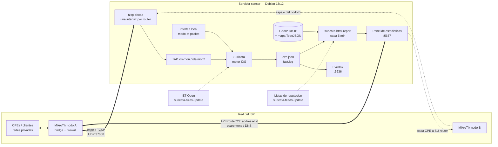

# suricata-ids-lab

Instalador de **Suricata en modo IDS** con **interfaz web (EveBox)** para
**Debian 13 (Trixie)** o Debian 12. Un solo comando en cualquier VPS o VM y en
minutos tienes alertas, flujos, DNS, TLS y HTTP visibles en el navegador.

> Debian 12 (bookworm) trae Suricata 6.0.x y Debian 13 (trixie) 7.0.x. El
> instalador funciona igual en ambos, pero solo se ha verificado en Debian 13.

Objetivo: detectar **clientes/CPEs infectados que escanean o atacan hacia
afuera** (el caso real que motiva esto), antes de llevarlo a un MikroTik de
produccion. Sin Elastic ni dependencias externas: EveBox lee `eve.json` y guarda
en SQLite local.

## Arquitectura

Como circula el trafico, quien lo inspecciona y donde acaban las alertas. Hay **dos
formas de alimentar al sensor**: escuchar una interfaz local (`af-packet`, el caso
simple) o recibir un **espejo TZSP** del MikroTik (el caso ISP, linea gruesa).



La flecha de vuelta del panel al MikroTik es la parte que **actua**: el panel manda
los CPE confirmados como infectados a una *address-list*, y es el MikroTik quien
decide que hacer con ellos con tus reglas. Todo es reversible desde el panel.

**Varios routers en un sensor.** Cada uno espeja por **su propia interfaz**, y de ahi sale de
que nodo es cada CPE. Eso importa porque lo normal es que cada nodo use `10.0.0.x`: sin saber el
router, `10.0.0.5` serian varios clientes mezclados en uno y el bloqueo podria acabar en el
MikroTik equivocado. Con el nodo, la identidad es el par **(router, IP)** y cada bloqueo sale
hacia donde corresponde. Se monta pasando todas las IPs en `-m`
(`-m 10.0.0.1,10.9.9.1,192.0.2.1`) y dando de alta cada nodo en **Ajustes → MikroTik**.

> Los routers deben estar **en la misma red que el sensor**: el espejo va por UDP sin
> retransmision, asi que a traves de un enlace con perdida el IDS ve trafico incompleto **sin
> avisar**. Para un nodo remoto es preferible un sensor propio.

### Por que no hay `docker-compose.yml`

No es un olvido, es una decision. El caso principal necesita un **dispositivo TAP**
(`ids-mon`), `NET_ADMIN` y red del host para recibir el espejo TZSP: en un contenedor
acabarias con `network_mode: host` + privilegios, o sea Docker de nombre y sin ganar
aislamiento. Ademas el panel **administra la maquina** (habla con la API del MikroTik,
consulta `suricatasc`, gestiona unidades de systemd y se autoactualiza desde GitHub),
que es justo lo contrario de un contenedor inmutable. El instalador es **idempotente**,
asi que re-ejecutarlo cumple el papel que tendria `docker compose up`.

## ⚡ Quick install (one-liner)

En una VM/VPS Debian 13/12 limpia, como root:

```bash
curl -fsSL https://raw.githubusercontent.com/mtandazo35/suricata-ids-lab/main/install-suricata.sh | sudo bash
```

Al terminar imprime la **URL de la web, el usuario `admin` y la clave generada**.
Entra con el navegador a `https://<IP>:5636` (certificado autofirmado: acepta la
advertencia).

Opciones (se pasan tras `bash -s --`):

| Opcion | Que hace | Default |
|---|---|---|
| `-i IFACE` | interfaz a escuchar | la de la ruta default |
| `-n CIDR[,CIDR]` | `HOME_NET` (admite varias redes separadas por coma; con `-t` pasa aqui las redes de tus clientes) | red de la interfaz |
| `-p PUERTO` | puerto de la web | `5636` |
| `-P CLAVE` | clave del usuario web `admin` | aleatoria (se muestra al final) |
| `-t` | **receptor TZSP** (UDP 37008) para espejo MikroTik. Requiere `-m` | apagado |
| `-m IP[,IP]` | con `-t`: **IP/CIDR de cada MikroTik** que envia espejo (varios = multi-nodo: una interfaz por router). Restringe UFW y el receptor solo a ese origen. **Obligatorio con `-t`**: sin origen conocido cualquier host de la red podria inyectar tramas forjadas en el IDS, y el receptor no arranca | - |
| `-W` | **sin web**, solo Suricata + logs | web activada |

### One-liner segun tu caso

Todos usan la misma URL; solo cambian las opciones tras `bash -s --`. El instalador es
**idempotente**: re-ejecutarlo con otras opciones re-configura sin romper lo anterior.

```bash
# 1) BASICO — captura la interfaz por defecto, con web. Para empezar y probar.
curl -fsSL https://raw.githubusercontent.com/mtandazo35/suricata-ids-lab/main/install-suricata.sh | sudo bash

# 2) INTERFAZ + RED fijas — cuando la auto-deteccion no acierta.
#    -i = interfaz a escuchar   -n = tu(s) red(es) HOME_NET
curl -fsSL https://raw.githubusercontent.com/mtandazo35/suricata-ids-lab/main/install-suricata.sh | sudo bash -s -- -i ens18 -n 10.0.0.0/24

# 3) ESPEJO DESDE MIKROTIK (TZSP) — el caso ISP. Monta el receptor y captura el espejo.
#    -t = activa el receptor TZSP (UDP 37008)
#    -m = IP del MikroTik que envia el espejo (restringe el 37008 solo a ese origen)
#    -n = las REDES DE TUS CLIENTES espejadas (para HOME_NET y detectar ataque saliente).
#         En un ISP lo normal es cubrir TODAS las redes privadas (RFC1918), porque los
#         CPE suelen estar repartidos en varios /16 (10.6.x, 10.69.x, 172.16.x...).
curl -fsSL https://raw.githubusercontent.com/mtandazo35/suricata-ids-lab/main/install-suricata.sh | sudo bash -s -- -t -m 10.87.87.1 -n 10.0.0.0/8,172.16.0.0/12,192.168.0.0/16

# 3b) VARIOS MIKROTIK en un solo sensor (multi-nodo).
#     Cada IP de -m es un router: el receptor le da SU interfaz (ids-mon, ids-mon2, ...)
#     para saber de que nodo es cada CPE. Sin eso, tres nodos con 10.0.0.x se
#     confundirian entre si y el bloqueo podria ir al router equivocado.
#     Despues, dar de alta cada nodo en Ajustes -> MikroTik (IP, usuario y clave de API).
curl -fsSL https://raw.githubusercontent.com/mtandazo35/suricata-ids-lab/main/install-suricata.sh | sudo bash -s -- -t -m 10.0.0.1,10.9.9.1,192.0.2.1 -n 10.0.0.0/8,172.16.0.0/12,192.168.0.0/16

# 4) WEB a tu medida — otro puerto y clave propia de EveBox.
#    -p = puerto de la web   -P = clave del usuario admin
curl -fsSL https://raw.githubusercontent.com/mtandazo35/suricata-ids-lab/main/install-suricata.sh | sudo bash -s -- -p 8443 -P 'MiClaveSegura'

# 5) SOLO SENSOR (sin web) — util si el panel lo pones aparte o solo quieres logs.
#    -W = sin web (solo Suricata + eve.json/fast.log)
curl -fsSL https://raw.githubusercontent.com/mtandazo35/suricata-ids-lab/main/install-suricata.sh | sudo bash -s -- -W

# 6) ISP COMPLETO — espejo MikroTik + interfaz fija + TODAS las redes privadas + clave.
curl -fsSL https://raw.githubusercontent.com/mtandazo35/suricata-ids-lab/main/install-suricata.sh | sudo bash -s -- -i ens18 -t -m 10.87.87.1 -n 10.0.0.0/8,172.16.0.0/12,192.168.0.0/16 -P 'MiClaveSegura'
```

> **Ojo con el `-n` en modo espejo (`-t`)**: van **las redes de tus clientes** (las IPs
> de los CPE que espejas), **no** la IP del servidor. Si `HOME_NET` esta mal, las reglas de
> ataque saliente (escaneo/Telnet/Mirai de los CPE) **no disparan** y el panel se ve vacio
> aunque el espejo llegue. En un ISP lo mas seguro es cubrir **todas las redes privadas**:
> `-n 10.0.0.0/8,172.16.0.0/12,192.168.0.0/16`.
>
> Cambiarlo despues sin reinstalar: edita `HOME_NET` en `/etc/suricata/suricata.yaml`
> (`HOME_NET: "[10.0.0.0/8,172.16.0.0/12,192.168.0.0/16]"`) y `systemctl restart suricata`.

Script de prueba de deteccion (se guarda en `/root`, segun convencion):

```bash
curl -fsSL https://raw.githubusercontent.com/mtandazo35/suricata-ids-lab/main/test-alerts.sh -o /root/test-alerts.sh && chmod +x /root/test-alerts.sh && sudo /root/test-alerts.sh
```

> La imagen `genericcloud` de Debian no trae `curl`: antes `apt-get update && apt-get install -y curl`.

## Comprobar que detecta

Tres scripts, cada uno responde una pregunta distinta:

| Script | Que responde | Manda trafico a la red |
|---|---|---|
| `test-alerts.sh` | ¿Suricata ve mi trafico y dispara firmas reales de ET Open? | si |
| `test-tzsp.sh` | ¿El receptor TZSP y la interfaz `ids-mon` funcionan? (sin MikroTik) | si, a `127.0.0.1` |
| `test-pcap.sh` | ¿Mi set de reglas detecta *esta* captura concreta? | **no**, es offline |

`test-pcap.sh` reproduce un `.pcap` con `suricata -r` y resume que firmas saltaron. Es
**determinista**, asi que sirve para comparar antes/despues de tocar reglas o exclusiones:

```bash
./test-pcap.sh captura.pcap -n 10.0.0.0/8      # -n: HOME_NET de esa captura
./test-pcap.sh --fuentes                       # de donde bajar capturas
```

> **Capturas con malware.** Las capturas publicas de trafico malicioso traen payloads de
> malware **real** (y suelen venir en ZIP con clave `infected`). **Nunca se guardan en este
> repositorio**: el script las descarga bajo demanda a un temporal, **exige su SHA256** y las
> borra al terminar. Reproducirlas con `suricata -r` no ejecuta nada, pero el archivo en disco
> si es malware: hazlo en una maquina de pruebas o un runner efimero, no en tu equipo.

## Desarrollo

Todo el proyecto es **un solo script** que lleva dentro, como heredocs, varios programas en
Python (el panel son ~5.400 lineas) y el JavaScript del mapa. Un error de sintaxis ahi no se
nota al hacer commit: se nota cuando rompe un servidor. Por eso:

```bash
./validar.sh
```

comprueba de una pasada la sintaxis de los `.sh`, extrae **cada programa incrustado** y lo
valida (`ast.parse` + `pyflakes` para Python, `sh -n` para shell), pasa `node --check` al
JavaScript del mapa, verifica que no se haya colado ningun **CRLF** (rompe los scripts en
Linux y git no lo delata) y que el **SHA256** de los assets vendorizados siga cuadrando con
las constantes del instalador. Lo mismo corre solo en cada push mediante GitHub Actions
(`.github/workflows/ci.yml`).

Al final ejecuta las **pruebas funcionales** de [`tests/`](tests/), que es lo que la sintaxis
no puede decir: que el codigo *haga* lo correcto. No necesitan Suricata ni un MikroTik —
`tests/extraer.py` saca la pieza real del instalador y la prueba contra dobles:

| Prueba | Que garantiza |
|---|---|
| `test_mapa.js` | zoom por pais, detalle por IP/puerto, y que "Vista completa" no pinte paises de negro |
| `test_orden*.js` | orden ascendente/descendente, fechas por tiempo real, y que el orden sobreviva a la recarga |
| `test_posicion.js` | que una accion no te mande al principio de la pagina |
| `test_masivo_*.js` | seleccion, avance visible y que un fallo a mitad no detenga el resto |
| `test_ruta_*.py` | que el router caido **no** borre del registro, que no haya falsos exitos y que no se pise lo que escribe el hilo de fondo |

Varias nacieron de fallos reales ya corregidos, asi que fallan si el fallo vuelve.

## Licencia

[MIT](LICENSE). Los archivos bajo `vendor/` son de terceros y mantienen su propia licencia;
ver [`vendor/mapa/ATTRIBUTION.md`](vendor/mapa/ATTRIBUTION.md).

### Comprobar que llegan todos los espejos

Con varios routers, si uno deja de espejar ese nodo se queda ciego y **no hay ningun otro
aviso**. El receptor escribe cada minuto el desglose por origen:

```bash
journalctl -u tzsp-decap -n 5
# tzsp-decap: rx=... tx=... por_origen=10.0.0.1:812,10.9.9.1:655,192.0.2.1:430
```

Si falta un origen: revisa el sniffer de ese MikroTik y que su IP este en el `-m`.

## Puertos y por donde se expone cada web

El instalador levanta **dos webs**, cada una en su puerto. Ambas escuchan en
`0.0.0.0` (todas las interfaces); exponlas solo por VPN, detras de tu proxy o
abriendo el puerto solo a tu IP.

| Puerto | Proto | Servicio | Web / URL | Login | Notas |
|---|---|---|---|---|---|
| **5636** | TCP / HTTPS | EveBox | `https://<IP>:5636` | usuario `admin` + clave del instalador | certificado autofirmado (acepta la advertencia); explorador de alertas |
| **5637** | TCP / HTTP | Panel de estadisticas | `http://<IP>:5637` | usuario `admin` + clave del instalador | reportes graficos; **HTTP plano**, ponlo detras de proxy/VPN |
| **37008** | UDP | Receptor TZSP (solo con `-t`) | — (no es web) | — | espejo desde el MikroTik; no lo abras a internet |

- Cambiar el puerto de **EveBox**: flag `-p PUERTO` al instalar, o `/etc/evebox/evebox.yaml`.
- Cambiar el puerto del **panel**: `PORT=` en `/etc/suricata-dashboard.conf` y
  `systemctl restart suricata-dashboard`.
- Detras de un proxy inverso (Nginx Proxy Manager / openresty) apunta al backend por
  **IP literal** (`http://<IP>:5637`), no por hostname, y en Advanced usa
  `proxy_http_version 1.1;` con `proxy_set_header Connection "";` para que no arrastre latencia.

## Apartado de estadisticas (panel web)

Ademas de EveBox, el instalador levanta un **panel de estadisticas** propio en su puerto
(5637 por defecto), pensado para ver de un vistazo y entregar reportes:

- **En vivo**: el reporte grafico (puertos atacados, IPs origen/destino, linea de tiempo,
  tabla de detalle) siempre al dia; se regenera solo si el ultimo tiene mas de 5 min.
- **Historico**: los 20 reportes mas recientes, cada uno abrible; el resto se borra solo.
- **Login basico** (usuario `admin`, clave aleatoria que imprime el instalador y guarda en
  `/etc/suricata-dashboard.conf`). Se sirve por HTTP plano: exponlo solo por VPN o detras
  de tu proxy, o abre el puerto solo a tu IP.

```
http://<IP>:5637      (usuario admin, la clave la imprime el instalador)
```

Servicio `suricata-dashboard`; cambiar puerto o clave en `/etc/suricata-dashboard.conf` y
`systemctl restart suricata-dashboard`.

## Interfaz web (EveBox)

Suricata no trae web propia; el instalador integra [EveBox](https://evebox.org):

- Se instala el **`.deb` oficial** (verificado por SHA256) descargado del pool de
  evebox.org. No se usa su repo apt porque su llave lleva firma SHA1 y Debian 13
  la rechaza. Se toma la version vigente del indice; si no responde, se usa la
  fijada en el script (0.28.0).
- **SQLite local** en `/var/lib/evebox`, retencion 7 dias y tope 5 GB.
- **HTTPS** con certificado autofirmado generado por EveBox y **login obligatorio**
  (usuario `admin`). La clave se crea antes del primer arranque; re-ejecutar el
  instalador **no** la cambia salvo que pases `-P`.
- Escucha en `0.0.0.0:5636`. Si UFW esta activo abre el puerto; si hay un firewall
  externo (nube, Proxmox, MikroTik) abrelo tu.
- El servicio corre como usuario `evebox`; el instalador le da acceso de lectura a
  `/var/log/suricata` via grupo + setgid.

```bash
# estado / logs
systemctl status evebox
journalctl -u evebox -f
```

Config: `/etc/evebox/evebox.yaml` (backup con fecha en cada ejecucion).

### Cambiar la clave de `admin`

**Opcion 1 (recomendada): re-ejecutar el instalador con `-P`.** Es idempotente:
no reinstala nada, cambia la clave del usuario existente y verifica que el
servicio levante. Al final imprime la URL, el usuario y la clave nueva.

```bash
curl -fsSL https://raw.githubusercontent.com/mtandazo35/suricata-ids-lab/main/install-suricata.sh | sudo bash -s -- -P 'TuClaveNueva'
```

**Opcion 2: el ayudante que deja el instalador**, sin preguntas:

```bash
evebox-passwd admin 'TuClaveNueva'
```

**Opcion 3: el CLI de EveBox** (interactivo, pide la clave dos veces):

```bash
runuser -u evebox -- evebox -D /var/lib/evebox -C /var/lib/evebox config users passwd admin
```

> Por que existe el ayudante: `evebox config users passwd` exige un TTY (falla con
> "The input device is not a TTY" desde scripts) y `users rm admin` falla por clave
> foranea en cuanto el usuario tiene sesiones web, asi que no se puede borrar y
> recrear. `evebox-passwd` le da un pseudo-terminal y responde las dos preguntas.
> Ejecuta siempre el CLI con `runuser -u evebox`: como root, `config.sqlite` puede
> quedar con dueño root y el servicio deja de poder escribirla.

**Clave perdida:** la opcion 1 o la 2 la reemplazan sin necesidad de conocer la
anterior.

## Montaje del lab

1. En Proxmox `10.0.0.2` crea una VM **Debian 13** (2 vCPU / 4–8 GB RAM basta para
   el lab; ver tabla de RAM abajo). Conectala a una `vmbr` aislada.
2. Copia este repo a la VM (a `/root/`, segun convencion) y ejecuta:

   ```bash
   chmod +x install-suricata.sh test-alerts.sh test-tzsp.sh
   sudo ./install-suricata.sh
   ```

   Auto-detecta la interfaz por la ruta default y fija `HOME_NET` a su red.
   Para forzar valores:

   ```bash
   sudo ./install-suricata.sh -i ens18 -n 10.0.0.0/24
   ```

3. Confirma que detecta:

   ```bash
   sudo ./test-alerts.sh            # DNS .top + User-Agent 'wget 3.0' + nmap al gateway
   tail -f /var/log/suricata/fast.log
   ```

   Las firmas de prueba son `ET DNS Query to a *.top domain` y `ET ADWARE_PUP Fake
   Wget User-Agent`; ambas vienen en ET Open. (El clasico testmynids.org ya no
   resuelve.) El trafico debe **salir por la interfaz** escuchada: lo que va por
   `lo` nunca lo ve el IDS.

## Que instala

- `suricata` + `suricata-update` (reglas **ET Open**) desde repos de Debian 13.
- **EveBox** (web) leyendo `eve.json` a SQLite, con auth y TLS. Ver seccion arriba.
- Con `-t`: **receptor TZSP** para espejo desde MikroTik. Ver seccion abajo.
- Modo **IDS pasivo AF_PACKET** sobre la interfaz elegida.
- `HOME_NET` = red de la interfaz (para que marque bien lo "saliente").
- **Offloads apagados** en la interfaz de captura (gro/lro/tso/gso/rx-gro-hw) con un
  drop-in de systemd: con ellos activos el kernel entrega tramas >1514 bytes y
  Suricata las descarta como `truncated packet` (visto en virtio/Proxmox).
- `memcap` conservador (512mb) — subir si aparecen `kernel_drops`.
- Servicio systemd habilitado. Backup de `suricata.yaml` con fecha.

## Ver alertas

```bash
# legible
tail -f /var/log/suricata/fast.log

# JSON filtrado: origen, destino, firma
tail -f /var/log/suricata/eve.json | \
  jq 'select(.event_type=="alert") | {src:.src_ip,dst:.dest_ip,sig:.alert.signature}'

# rendimiento / drops
grep -E 'kernel_drops|memcap' /var/log/suricata/stats.log
```

## RAM segun trafico espejeado

| Trafico | RAM |
|---|---|
| Lab / hasta ~200 Mbps | 4 GB |
| ~500 Mbps – 1 Gbps | 8 GB |
| 1–3 Gbps | 16 GB (subir `stream.memcap`/`flow.memcap`) |

En Suricata la RAM la mandan los `memcap`, no el disco. Vigila `memcap_drop` en
`stats.log`: mientras no aparezcan, no hace falta mas RAM.

## Deteccion de escaneo, informe diario y auto-update

El instalador anade tres cosas utiles para operar sin entrar a la web:

- **Reglas propias de escaneo saliente** (`/var/lib/suricata/rules/local.rules`, sids
  9000000+). ET Open no detecta port-scan; estas cazan el caso que motiva el lab: un CPE
  de HOME_NET escaneando o atacando hacia afuera. Puertos
  tipicos de botnet IoT (Telnet 23/2323, TR-069 7547, ADB 5555, SMB 445, RDP/VNC,
  SMTP directo 25). No hay regla generica de "todo el trafico": sobre un espejo de ISP
  eso agota la RAM del sensor. Ajusta los umbrales (`threshold ... count N`) a tu red editando el
  archivo y `suricatasc -c reload-rules`.
- **Auto-update diario de reglas ET** a las 04:30 (`suricata-rules-update.timer`), con
  recarga en caliente (`suricatasc -c reload-rules`, sin reiniciar el motor).
- **Informe diario a las 07:30** (`suricata-report.timer`), en dos formatos:
  - **Texto claro por Telegram**: agrupa por gravedad (INFECTADOS / ATACANDO /
    SOSPECHOSOS), una linea por equipo con que le pasa y que hacer. Rellena el token de
    bot y tu chat_id en `/etc/suricata-report.conf`; sin eso se guarda en
    `/var/log/suricata/report-AAAAMMDD.txt`. A mano: `suricata-report`.
  - **Reporte HTML grafico** (`suricata-html-report` -> `report-AAAAMMDD-HHMM.html`):
    puertos de destino mas atacados, top de IPs origen (atacantes) y destino (objetivos),
    linea de tiempo por hora, y una tabla de detalle con origen IP:puerto -> destino
    IP:puerto, firma, veces y duracion (primera -> ultima vez). Autocontenido, se abre en
    el navegador o se imprime a PDF para entregar. El historico guarda los 20 reportes mas recientes (auto-borrado en cada generacion).

## Espejo desde MikroTik (TZSP)

Para analizar el trafico real de tu red MikroTik hay que **espejarlo** hacia el
servidor. El camino sin hardware extra es **TZSP**: el router envuelve cada paquete
en UDP/37008 y lo manda al servidor. Suricata **no** entiende TZSP crudo (solo
genera `truncated packet`), asi que el instalador con `-t` monta un receptor:

```
MikroTik --TZSP UDP/37008--> tzsp-decap.py --trama Ethernet--> veth ids-in -> ids-mon --> Suricata
```

- `tzsp-decap.service`: desencapsulador en Python (stdlib), crea el par veth,
  reinyecta las tramas y loguea `rx/tx` cada 60 s en `journalctl -u tzsp-decap`.
- Suricata captura `ids-mon` como segunda interfaz af-packet, con
  `checksum-checks: no` y `stream.checksum-validation: no` (el trafico espejeado
  llega con checksums de offload rotos; sin esto todo seria `invalid checksum`).
- Abre `37008/udp` en UFW si esta activo. Si hay firewall externo, abrelo tu.

### Ajustes automaticos en modo espejo

Con `-t` el instalador aplica lo que hizo falta al conectar un MikroTik real
(~32k pps): sin esto el disco se llenaba y la deteccion moria a los pocos minutos.

- **veth `ids-in`/`ids-mon` con MTU 65535** y `block-size: 131072` en Suricata. El
  router agrega segmentos (GRO) y manda tramas de hasta ~22 kB; con MTU 1600 o 9000
  se perdian (`muy_grandes` en el log del receptor) y cada trama perdida es un hueco
  mas en el reensamblado.
- **Filtro BPF en la interfaz principal**: `not (udp port 37008 or fragmentos IP)`, para
  que Suricata no inspeccione el propio flujo TZSP (doble CPU, alertas `truncated`).
- **Memcaps segun la RAM real** (siempre, no solo con -t): reensamblado TCP 25 %,
  flow 6 %, stream 6 %, defrag 1.5 %. Con el valor fijo anterior (512 MB) el
  reensamblado se llenaba a los ~5 min y, como el memcap es global, Suricata dejaba de
  reensamblar **todo**, tambien el trafico propio: las firmas HTTP dejaban de disparar.
- **`stream.midstream: true` y `async-oneside: true`** (el espejo llega con perdidas y
  sesiones ya empezadas). Se insertan bajo `stream:`; en el yaml de Debian vienen
  comentadas.
- **Reglas de diagnostico interno fuera** via `/etc/suricata/disable.conf`: todas las
  `SURICATA *` (stream, decoder, quic, tls, http...; viven en 22 archivos
  `*-events.rules`). Con espejo asimetrico eran el 95 % de las alertas
  (`STREAM invalid ack`, `QUIC error on data`, `TLS handshake invalid length`).
  Tambien las 4 firmas `ET INFO STUN Binding ...` (WebRTC/videollamadas): en un ISP
  eran el 68 % de las alertas restantes y no indican nada malo.
- **Bypass de flujos cifrados**: `stream.bypass: true` + `tls.encryption-handling:
  bypass`, TCP establecido 600 -> 300 s y `reassembly.depth` 1 MB -> 512 kB. Sin esto
  el reensamblado crecia ~100 MB/min sin meseta reteniendo segmentos de flujos que
  nunca se iban a inspeccionar.
- **eve.json solo con `alert`, `http`, `tls`, `ssh`, `files` y `stats`**, que es lo que
  EveBox necesita, y el **DNS aparte en `dns.json`** (solo consultas). Con espejo real
  `flow` era el 76 % del volumen y `dns` el 15 % (15 MB/s = 1,3 TB/dia); EveBox
  (SQLite) ingiere ~600 eventos/s y se quedaba 30 min atrasado purgando en bucle.
  Para volver a activar un tipo, descomenta su linea en `outputs: eve-log: types:`.
  Referencia medida: eve.json ~2 MiB/min y dns.json ~40 MiB/min con ~32k pps; el
  logrotate horario con `maxsize 2G` rota dns.json cada hora (7 copias comprimidas).
- **Logrotate instalado y forzado**: cada hora (drop-in del timer), `maxsize 2G`,
  7 copias. Debian trae rotacion semanal sin tope y en una Debian minima ni siquiera
  viene el paquete `logrotate`. EveBox guarda sus datos aparte en SQLite (7 dias /
  5 GB), asi que truncar o rotar eve.json no borra lo que ya se ve en la web.

Cifras de referencia: ~32k pps espejeados, receptor Python sin descartes, Suricata con
8 hilos por interfaz y ~2 % de `kernel_drops` en una VM de 8 vCPU / 16 GB. Para mas
volumen, mirror por hardware (Opcion C). Vigila `tcp.reassembly_memuse` en
`stats.log`: si se pega al memcap, falta RAM.

### 1. Instalar el receptor

Pasa `-t`, en `-m` **la IP del MikroTik que envia el espejo** y en `-n` **las redes
de tus clientes** (separadas por coma), para que Suricata sepa que es "casa" y
marque bien lo saliente:

```bash
curl -fsSL https://raw.githubusercontent.com/mtandazo35/suricata-ids-lab/main/install-suricata.sh | sudo bash -s -- -t -m 10.87.87.1 -n 172.16.0.0/12,10.0.0.0/8
```

Probar sin MikroTik (manda una trama TZSP sintetica y espera la alerta):

```bash
curl -fsSL https://raw.githubusercontent.com/mtandazo35/suricata-ids-lab/main/test-tzsp.sh -o /root/test-tzsp.sh && chmod +x /root/test-tzsp.sh && sudo /root/test-tzsp.sh
```

### 2. Comandos en el MikroTik

Sustituye `IP_SURICATA` por la IP del servidor (la que imprime el instalador) y
`bridge` / `172.16.10.0/24` por tu interfaz y tu red de clientes.

> **v6 y v7.** Los comandos de espejo (`/tool sniffer` y `action=sniff-tzsp`) son
> **iguales en RouterOS v6 y v7**; funcionan igual copiados tal cual. Aun asi abajo
> dejo el bloque de cada version por separado para que cualquiera aplique el suyo,
> y marco las **dos** diferencias reales: en v7 `filter-interface` admite varias
> interfaces separadas por coma, y el **fasttrack** de v7 tambien cubre IPv6 (hay que
> excluir ambos). Para saber tu version: `/system resource print` (campo `version`).

**Opcion A: todo el trafico de una interfaz** (`/tool sniffer` en modo streaming).
Elige la interfaz donde pasa el trafico de clientes (el bridge LAN o el ether WAN).

RouterOS **v6**:

```routeros
/tool sniffer set streaming-enabled=yes streaming-server=IP_SURICATA filter-stream=yes filter-interface=bridge
/tool sniffer start
# el sniffer NO sobrevive al reinicio: arrancarlo con el scheduler
/system scheduler add name=sniffer-start start-time=startup on-event="/tool sniffer start"
/tool sniffer print
```

RouterOS **v7** (identico; `filter-interface` puede llevar varias interfaces):

```routeros
/tool sniffer set streaming-enabled=yes streaming-server=IP_SURICATA filter-stream=yes filter-interface=bridge
# v7: espejar mas de una interfaz a la vez -> filter-interface=bridge1,bridge2
/tool sniffer start
/system scheduler add name=sniffer-start start-time=startup on-event="/tool sniffer start"
/tool sniffer print
```

Filtros utiles para no espejar todo (iguales en v6 y v7). `filter-ip-address`
acepta una **lista de IPs/redes separadas por coma**, asi que sirve para espejar
solo unos clientes concretos:

```routeros
# lista de IPs concretas (los CPE que quieres vigilar) + alguna red
/tool sniffer set filter-ip-address=172.16.10.25,172.16.10.60,172.16.10.61,172.16.20.0/24
# solo lo que sale hacia internet (reduce a la mitad): rx en el bridge LAN, tx si sniffas el ether WAN
/tool sniffer set filter-direction=rx
# solo DNS + HTTP + HTTPS
/tool sniffer set filter-port=53,80,443
```

> **Los filtros del sniffer se combinan con `or`, no con `and`.** Es la causa mas comun
> de que "el filtro no filtro nada": `filter-interface=bridge` mas `filter-port=53` **no**
> espeja el DNS del bridge, espeja *todo* el bridge **mas** *todo* el puerto 53 de
> cualquier interfaz, o sea mas trafico que antes de poner el filtro. El valor por
> defecto de `filter-operator-between-entries` es `or` y hay que cambiarlo a mano:
>
> ```routeros
> # sin esto cada filtro SUMA trafico en vez de restarlo
> /tool sniffer set filter-operator-between-entries=and
> /tool sniffer set filter-interface=bridge filter-port=53
> ```
>
> Con `and` el sniffer espeja solo lo que cumple **todas** las condiciones. Comprueba
> siempre el resultado en el servidor (`journalctl -u tzsp-decap -f`): si `rx` sube en
> vez de bajar, sigues en `or`.

**Opcion B: selectivo por LISTA DE IPs** (`address-list` + `action=sniff-tzsp` en
mangle). Es la forma recomendada en un ISP: mantienes una lista con los CPE que
quieres vigilar y una sola regla los espeja a todos. Anadir o quitar un cliente es
tocar la lista, no la regla. **Misma sintaxis en v6 y v7.**

Paso 1 — crea la lista `ids-vigilados` con las IPs a espejar (una linea por IP; se
pueden agregar cuando quieras):

```routeros
/ip firewall address-list
add list=ids-vigilados address=172.16.10.25  comment="CPE Juan Perez"
add list=ids-vigilados address=172.16.10.60  comment="CPE Local 3"
add list=ids-vigilados address=172.16.20.0/24 comment="barrio norte"
```

Paso 2 — dos reglas mangle que espejan lo que sale de esas IPs y lo que les vuelve:

```routeros
/ip firewall mangle
add chain=prerouting src-address-list=ids-vigilados action=sniff-tzsp sniff-target=IP_SURICATA sniff-target-port=37008 passthrough=yes comment="espejo IDS (ida)"
add chain=forward dst-address-list=ids-vigilados action=sniff-tzsp sniff-target=IP_SURICATA sniff-target-port=37008 passthrough=yes comment="espejo IDS (vuelta)"
```

Gestionar la lista despues (sin tocar las reglas):

```routeros
/ip firewall address-list add list=ids-vigilados address=172.16.10.99 comment="CPE nuevo"
/ip firewall address-list print where list=ids-vigilados
/ip firewall address-list remove [find list=ids-vigilados address=172.16.10.25]
```

> **Fasttrack (la unica diferencia que importa).** Con `fasttrack-connection` activo,
> mangle solo ve los primeros paquetes de cada conexion: se espeja el SYN y el DNS,
> pero no el HTTP. Excluye del fasttrack a la **misma lista** `ids-vigilados` (asi el
> filtro tambien se controla desde la lista), o usa la Opcion A.
>
> - **v6** (solo IPv4):
>   ```routeros
>   /ip firewall filter set [find action=fasttrack-connection] src-address-list=!ids-vigilados
>   ```
> - **v7** (el fasttrack viene activo de fabrica y tambien hay IPv6, excluye los dos):
>   ```routeros
>   /ip firewall filter set [find action=fasttrack-connection] src-address-list=!ids-vigilados
>   /ipv6 firewall filter set [find action=fasttrack-connection] src-address-list=!ids-vigilados
>   ```

Verificar en el servidor:

```bash
journalctl -u tzsp-decap -f          # rx/tx deben subir; ultimo_origen = IP del MikroTik
tail -f /var/log/suricata/fast.log   # y en la web EveBox
```

Como leer el log del receptor (una linea cada 60 s):

| Campo | Significado |
|---|---|
| `rx` | paquetes TZSP recibidos del MikroTik |
| `tx` | tramas Ethernet entregadas a Suricata por el veth |
| `muy_grandes` | tramas mayores que el MTU del veth; deben ser 0 con MTU 9000 |
| `ultimo_origen` | IP del MikroTik que esta espejeando |

`rx` y `tx` deben subir juntos; si `rx` sube y `tx` no, el veth esta caido o
Suricata no escucha `ids-mon`. Si `rx` no se mueve, el problema esta en el
router o en el firewall (UDP 37008).

> **Cuidado con el volumen.** TZSP duplica en la red todo lo que espejas y lo
> encapsula el CPU del router. Empieza con una red pequena o con filtros, mira el
> CPU del MikroTik (`/system resource monitor`) y `kernel_drops` en `stats.log`.
> El desencapsulador en Python aguanto ~32k pps (~100-150 Mbps) sin descartes en la
> prueba real; para varios cientos de Mbps conviene el espejo por hardware.
>
> Si el sensor **no** esta en la misma red que el router (VPN, tunel, enlace de ultimo
> milla), ese volumen se lo come el enlace: ver [Sensor remoto](#3-sensor-remoto-espejar-sin-comerse-el-enlace).

**Opcion C: mirror por hardware** (switch-chip, sin CPU del router). Requiere un
puerto libre en el MikroTik cableado a una NIC dedicada del servidor (en Proxmox,
un bridge propio para esa NIC, sin IP). Suricata escucha esa NIC directamente
(`-i ens19`), sin TZSP. La sintaxis **no depende de la version** (v6 y v7 igual)
sino del chip switch del equipo:

```routeros
# switch-chip clasico (RB, hEX, CCR con switch)
/interface ethernet switch set switch1 mirror-source=ether2 mirror-target=ether5
# CRS3xx / RB5009 (por puerto)
/interface ethernet switch port set ether2 mirror-ingress=yes mirror-egress=yes mirror-ingress-target=ether5 mirror-egress-target=ether5
```

### 3. Sensor remoto: espejar sin comerse el enlace

El espejo pensado para un cable de 1 Gbps no cabe en un tunel. Caso medido: un sensor al
otro lado de una VPN con el espejo completo de un bridge = **~300 Mbps** permanentes por
el tunel, para un trafico de clientes que era una fraccion de eso (TZSP **duplica** todo
lo que espejas y ademas lo encapsula). El enlace se saturo antes que el sensor.

La salida no es comprimir ni encolar: es **espejar menos, y espejar lo que sirve**.

#### El filtro que de verdad importa: `connection-bytes`

Suricata detecta casi todo en el **arranque** de cada conexion: el SYN (escaneo,
fuerza bruta), el handshake TLS con el SNI y el JA3 (C2, botnet), la cabecera HTTP
(user-agent, host, URI) y las consultas DNS. Lo que viene despues es **payload**, y si la
conexion es TLS ni siquiera se puede inspeccionar: son megabytes que cruzan el tunel para
que Suricata los descarte.

Espejar solo los primeros ~10 kB de cada conexion baja el trafico **un orden de magnitud**
sin perder deteccion de escaneo, botnet, fuerza bruta, C2 ni DNS:

```routeros
/ip firewall mangle
add chain=prerouting src-address-list=ids-vigilados connection-bytes=0-10000 \
    action=sniff-tzsp sniff-target=IP_SURICATA sniff-target-port=37008 \
    passthrough=yes comment="espejo IDS: solo el arranque de cada conexion"
```

`connection-bytes=0-10000` cuenta los bytes **acumulados de la conexion**: la regla deja
de hacer match cuando esa conexion pasa de 10 kB, y el resto de la descarga ya no se
espeja. Sube el limite si quieres mas margen; bajarlo de ~4 kB empieza a cortar handshakes
TLS largos (cadenas de certificados).

El **DNS va aparte, con su propia regla y sin `connection-bytes`**: es diminuto y es donde
mas se detecta (dominios de C2, DGA, tunneling), asi que se espeja entero:

```routeros
/ip firewall mangle
add chain=prerouting src-address-list=ids-vigilados protocol=udp dst-port=53 \
    action=sniff-tzsp sniff-target=IP_SURICATA sniff-target-port=37008 \
    passthrough=yes comment="espejo IDS: DNS completo, pesa nada y detecta mucho"
```

**Lo que se pierde** con esto es la inspeccion de contenido a mitad de una transferencia:
el ejecutable que baja en el byte 900000 de un HTTP sin cifrar, la firma que dispara
dentro del cuerpo de una respuesta larga. En un ISP con TLS en casi todo eso ya era ciego;
en un enlace remoto, cambiarlo por poder ver **todas** las conexiones es el trato bueno.

#### Fragmentacion sobre el tunel

TZSP encapsula la **trama entera** y le suma su cabecera. Sobre un tunel con MTU 1400 una
trama de 1514 bytes no cabe: se fragmenta, y lo que era un paquete pasan a ser dos. El
conteo de paquetes se duplica, el CPU del router sube y cualquier fragmento que se pierda
invalida la trama completa (el receptor la cuenta pero Suricata ya no la reensambla).

Con `connection-bytes` el problema casi desaparece solo, porque **los paquetes grandes son
justo los de payload**: lo que queda del espejo son SYN, handshakes y consultas DNS, que
son paquetes pequenos y caben sin fragmentar.

#### El TZSP es UDP: lo que no cabe no se encola, se pierde

Esto es lo que hace peligroso el espejo remoto. TZSP va sobre UDP sin retransmision ni
control de flujo: cuando el enlace se congestiona el espejo **no se retrasa, desaparece**.
Y desaparece en silencio: Suricata ve medio handshake, no reensambla la sesion y
simplemente **no alerta**. Un IDS que no alerta se parece mucho a una red limpia.

Por eso la regla es **reducir en origen** (en el MikroTik, con `connection-bytes` y las
listas) y **no poner una cola que limite el espejo**. Una `queue` sobre el trafico TZSP no
arregla nada: convierte el exceso de trafico en **puntos ciegos silenciosos**, que es
exactamente el fallo que no se detecta mirando graficas. Si hay que elegir, es mejor
vigilar menos IPs bien que todas a medias: quita CPE de `ids-vigilados` hasta que el
espejo entre holgado en el enlace.

Senales de que ya te estas pasando: `rx` en `journalctl -u tzsp-decap` mucho menor que los
paquetes que el router dice espejar, alertas que aparecen a rachas, o Suricata sin registrar
casi ninguna sesion TLS completa.

#### La opcion de fondo: llevar el sensor, no los paquetes

Si el sitio remoto es un nodo estable, lo correcto no es afinar el espejo: es **poner un
sensor en el sitio del cliente** y que por el enlace viaje **solo el reporte**, no los
paquetes. El instalador es el mismo one-liner, y el nodo remoto puede espejar a su propio
sensor por la LAN local, sin tunel de por medio.

Lo que cambia en numeros: en vez de cientos de Mbps constantes, el enlace lleva **kilobytes
por hora** (las alertas, el informe diario por Telegram, el HTML si lo quieres fuera). Y lo
que cambia en fiabilidad es mas importante: si el enlace se cae un rato, el sensor local
sigue capturando y detectando; con espejo remoto, un enlace caido es un IDS ciego con el
servicio en verde.

> El envio a Loki/Grafana se agrega como modulo cuando se necesite.
